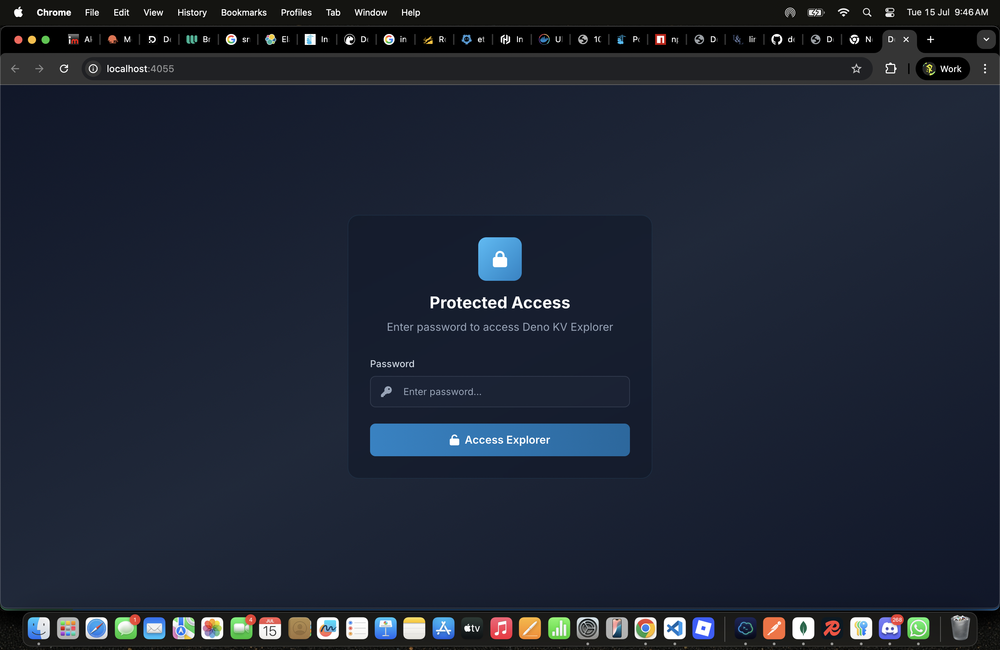
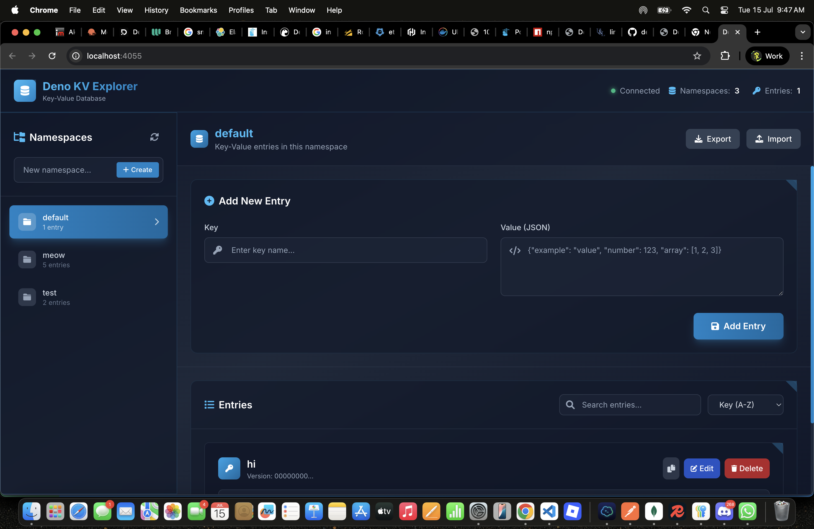

# 🗄️ Deno KV Explorer

<div align="center">


**A beautiful web interface for exploring and managing Deno KV databases.**

[](https://opensource.org/licenses/MIT)
[](https://www.typescriptlang.org/)
[](https://bun.sh)

</div>

## ✨ Features

- 🎨 **Beautiful UI** - Modern design with clean aesthetics
- 🔍 **Advanced Search & Filtering** - Real-time search across keys and values
- 📁 **Namespace Management** - Create and manage multiple namespaces with ease
- ⚡ **Real-time Updates** - Live synchronization across multiple browser sessions
- 🚀 **Performance Optimized** - Fast and responsive with efficient data handling
- 📱 **Responsive Design** - Works perfectly on desktop, tablet, and mobile devices
- 🎯 **Intuitive UX** - Clean, modern interface with helpful visual feedback
- 🔧 **Developer Friendly** - Built with TypeScript and modern web technologies

## � Screenshots

<div align="center">

### 🔐 Secure Login Screen


*Optional password protection with session-based authentication*

### 🗄️ Main Interface


*Clean, modern interface for managing your Deno KV database*

</div>

## �🚀 Quick Start

### Prerequisites

- [Bun](https://bun.sh) runtime (v1.2.17+) OR [Docker](https://docker.com)
- [Deno KV](https://deno.com/kv) database access

### Installation

#### Option 1: Using bunx/npx (Recommended)

```bash
# Run directly without installation (from npm)
bunx deno-kv-explorer
# OR
npx deno-kv-explorer

# With environment variables
KV_URL=http://localhost:4512 PASSWORD=mysecret bunx deno-kv-explorer
```

#### Option 2: Install Globally

```bash
# Install from npm
npm install -g deno-kv-explorer

# Then run
deno-kv-explorer

# Or with environment variables
KV_URL=http://localhost:4512 PASSWORD=mysecret deno-kv-explorer
```

#### Option 3: Local Development

```bash
# Clone the repository
git clone https://github.com/akshit-wtf/deno-kv-explorer
cd deno-kv-explorer

# Install dependencies
bun install

# Configure environment (optional)
cp .env.example .env
# Edit .env with your settings
```

#### Option 4: Docker (Recommended for Production)

```bash
# Using pre-built image from GitHub Container Registry
docker run -p 4055:4055 \
  -e KV_URL=your_kv_url \
  -e PASSWORD=your_password \
  ghcr.io/akshit-wtf/deno-kv-explorer:latest

# Or with docker-compose
git clone https://github.com/akshit-wtf/deno-kv-explorer
cd deno-kv-explorer
# Edit .env with your settings
docker-compose up -d
```

### Running the Application

#### Local Development

```bash
# Development mode with hot reload
bun run dev

# Production mode
bun start
```

#### Docker

```bash
# Using Docker Compose (recommended)
docker-compose up -d

# Or build and run manually
docker build -t deno-kv-explorer .
docker run -p 4055:4055 --env-file .env deno-kv-explorer
```

The application will be available at `http://localhost:4055`

### 📱 Mobile Support

Deno KV Explorer is fully responsive and optimized for mobile devices:

- **Touch-friendly interface** with appropriate button sizes
- **Mobile sidebar** that slides in/out smoothly
- **Responsive layouts** that adapt to screen size
- **Optimized typography** for readability on small screens

## 🏗️ Architecture

Deno KV Explorer is built with modern web technologies:

- **Backend**: Bun runtime with WebSocket support
- **Frontend**: Vanilla JavaScript with Tailwind CSS
- **Database**: Deno KV for persistent storage
- **Real-time**: WebSocket-based live updates
- **Design**: Modern UI with glass morphism aesthetics

## 📖 Usage

### Creating Namespaces

1. Enter a namespace name in the sidebar input
2. Press Enter or click "Create" 
3. The namespace will be created and automatically selected

### Managing Entries

- **Add Entry**: Fill in the key and value (JSON format), then click "Add Entry"
- **Edit Entry**: Click the "Edit" button on any entry to populate the form
- **Delete Entry**: Click the "Delete" button and confirm the action
- **Search**: Use the search bar to filter entries by key or value
- **Sort**: Use the dropdown to sort entries by key or creation time

### Features

- **Real-time Sync**: Changes are instantly visible across all connected sessions
- **Search & Filter**: Quickly find entries with the built-in search functionality
- **Export/Import**: Backup and restore your data in JSON format
- **Mobile Responsive**: Full mobile support with touch-friendly interface
- **Docker Ready**: Easy deployment with Docker and Docker Compose
- **Password Protection**: Optional password protection for secure access
- **Session Management**: Session-based authentication that expires on page reload

## 🔒 Security

### Password Protection

Deno KV Explorer supports optional password protection:

```bash
# Set password via environment variable
PASSWORD=your_secure_password bunx deno-kv-explorer

# Or in .env file
echo "PASSWORD=your_secure_password" >> .env
```

**Security Features:**
- Session-based authentication
- Password expires on page reload/close
- No persistent login storage
- Optional protection (disabled by default)

## 🛠️ Configuration

### Environment Variables

Create a `.env` file from the example:

```bash
cp .env.example .env
```

Available configuration options:

| Variable | Description | Default |
|----------|-------------|---------|
| `DENO_KV_ACCESS_TOKEN` | Your Deno KV access token | Required |
| `KV_URL` | Deno KV server URL | `http://localhost:4512` |
| `PORT` | Application port | `4055` |
| `PASSWORD` | Access password (optional) | Not set (no password) |
| `NODE_ENV` | Environment mode | `development` |

### Docker Configuration

For Docker deployments, use the provided `docker-compose.yml`:

```yaml
version: '3.8'
services:
  deno-kv-explorer:
    build: .
    ports:
      - "4055:4055"
    environment:
      - DENO_KV_ACCESS_TOKEN=your_token_here
      - KV_URL=http://your_kv_server:4512
```

## 🐳 Docker Deployment

### Production Deployment

1. **Clone and configure**:
   ```bash
   git clone https://github.com/akshit-wtf/deno-kv-explorer
   cd deno-kv-explorer
   cp .env.example .env
   # Edit .env with your production values
   ```

2. **Deploy with Docker Compose**:
   ```bash
   docker-compose up -d
   ```

3. **Monitor logs**:
   ```bash
   docker-compose logs -f deno-kv-explorer
   ```

### Health Checks

The Docker container includes built-in health checks:
- **Endpoint**: `GET /`
- **Interval**: 30 seconds
- **Timeout**: 10 seconds
- **Retries**: 3 attempts

### Scaling

To run multiple instances:

```bash
docker-compose up -d --scale deno-kv-explorer=3
```

## 📦 npm Package

This project is published to [npm](https://www.npmjs.com/package/deno-kv-explorer) for easy installation and distribution.

### Installing from npm

The package is available as a public npm package:

```bash
# No special configuration needed for public npm packages
# Install globally
npm install -g deno-kv-explorer

# Or run directly
npx deno-kv-explorer
bunx deno-kv-explorer
```

### Publishing

Publishing is automated via GitHub Actions when a release is created:

1. **Create a release** on GitHub with a version tag (e.g., `v1.0.1`)
2. **GitHub Actions** automatically builds and publishes to npm
3. **Docker images** are also built and pushed to GitHub Container Registry

For manual publishing:

```bash
# Ensure you're authenticated with npm
npm login

# Publish
npm publish
```

### Docker Images

Docker images are available from GitHub Container Registry:

```bash
# Pull the latest image
docker pull ghcr.io/akshit-wtf/deno-kv-explorer:latest

# Run the container
docker run -p 4055:4055 ghcr.io/akshit-wtf/deno-kv-explorer:latest
```

## 📦 Project Structure

```
deno-kv-explorer/
├── index.ts          # Main server and WebSocket logic
├── index.html        # Frontend application
├── package.json      # Project configuration
├── tsconfig.json     # TypeScript configuration
├── Dockerfile        # Docker container configuration
├── docker-compose.yml # Docker Compose setup
├── .env.example      # Environment variables template
├── .dockerignore     # Docker ignore patterns
└── README.md         # Documentation
```

## 🎨 Design Philosophy

Deno KV Explorer follows the principles of **simplicity and functionality**:

- **Simplicity**: Clean, uncluttered interface
- **Precision**: Carefully crafted user experience
- **Elegance**: Beautiful visual design with subtle animations
- **Functionality**: Every feature serves a clear purpose

## 🎨 Gallery

<div align="center">

| Feature | Preview |
|---------|---------|
| **🔐 Secure Access** |  |
| **🗂️ Database Management** |  |

*Experience the modern, intuitive interface designed for productivity*

</div>

## 🤝 Contributing

We welcome contributions! Please feel free to submit issues and pull requests.

## 📄 License

This project is licensed under the MIT License - see the LICENSE file for details.

---

<div align="center">
Made with ❤️ by <a href="https://akshit.me">Akshit Kumar</a>
</div>
